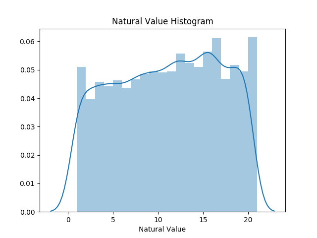
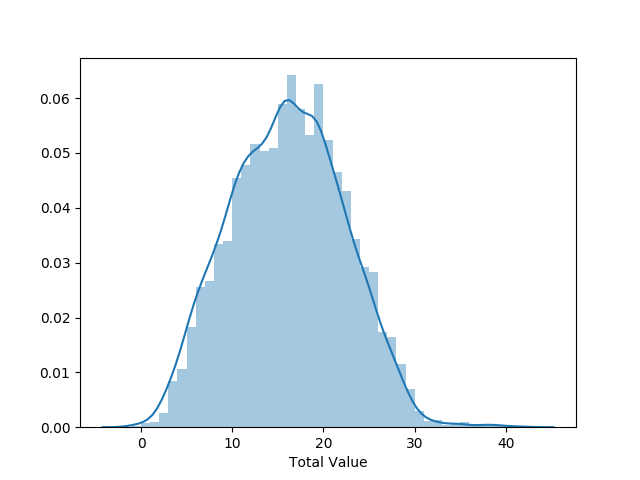
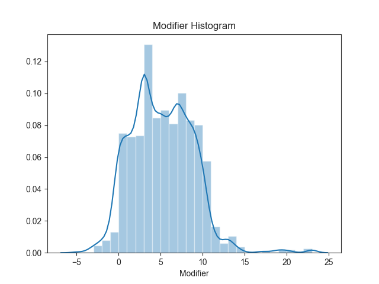
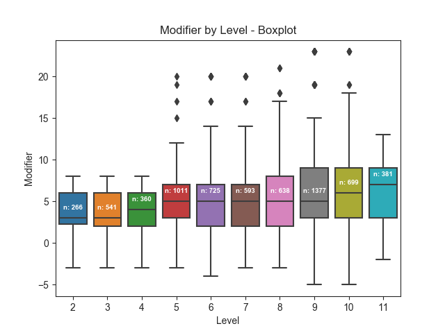
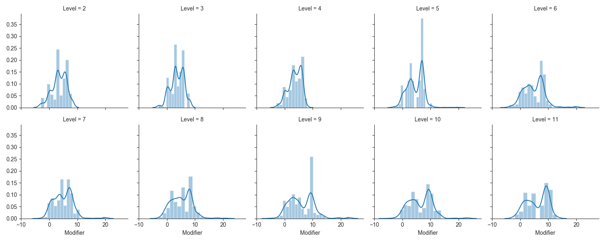
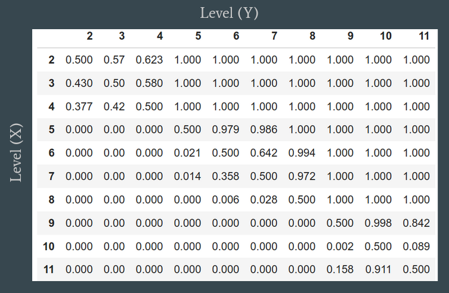

# Mighty-Rolls
A dive into a Dungeons and Dragons 5e campaign


# Introduction

Dungeons and Dragons 5th edition (DnD 5e) is a tabletop role-playing game published by Wizards of the Coast.
The core rules of the game are formed by three kind of d20(20-sided die) rolls; ability checks, attack rolls,
and saving throws.

The outcome of a task is decided by these steps:
1. Roll the die and add a modifier
2. Apply circumstantial bonuses and penalties
3. Compare the total to a target number

This presentation will focus on the modifier value added to d20 rolls. The modifier value is a combination of values 
 such as ability scores, proficiency bonus, and/or spell effects.


# Importing and Cleaning the Data

Dataset located [here](https://docs.google.com/spreadsheets/d/1FFuw5c6Hk1NUlHv2Wvr5b9AElLA51KtRl9ZruPU8r9k/edit#gid=0), as a Google Sheets spreadsheet, maintained by [CritRoleStats](https://www.critrolestats.com/), includes 11107 rows and 11 columns.
After cleaning, there are 6591 rows, and 6 important columns;
‘Character’, ‘Type of Roll’, ‘Total Value’, ‘Natural Value’, ‘Level’, and ‘Modifier = (Total Value - Natural Value)’


<details>
    <summary>Load Packages</summary>
    
   ```python
import os
import numpy as np
import pandas as pd
import seaborn as sns
import matplotlib.pyplot as plt
   ```
</details>
<details>
  <summary>Import code</summary>
  
  ```python
def html_to_df(dirpath):
frames = []
for filename in os.listdir(dirpath):
    if filename.endswith('.html'):
        fullpath = os.path.join(dirpath, filename)
        frames.append(pd.read_html(fullpath, header=1, index_col=0)[0])
return pd.concat(frames).reset_index(drop=True)
  ```
 </details>
 
 <details>
    <summary>Clean data code</summary>
    
 ```python
def remove_rows(df, col, lst):
    df = df[~df[col].isin(lst)]
    return df[df[col].notnull()]

def use_this_df():
    # create df of level in each episode
    ep_formatted = pd.read_csv('./data/level_by_ep.csv', names=['episode_int','Episode','Level'])
    df_ep_level = ep_formatted.filter(['episode_int', 'Level']).set_index('episode_int')

    # fix episode names
    df = html_to_df(dirpath).dropna(subset=['Episode'])
    df['episode_int'] = df['Episode'].apply(lambda x: x[-2:]).astype('int64')

    # join df_ep_level
    df = df.join(df_ep_level, on='episode_int')

    # remove not d20 rolls
    d20_filter_out_list = ['Other', 'Damage', 'Fragment', 'Percentage', 'Unknown', 'Hit Dice']
    df = remove_rows(df, 'Type of Roll', d20_filter_out_list)

    # clean Total Value
    remove_list = ['Nat'+str(i) for i in range(21)]
    remove_list.append('Unknown')
    df = remove_rows(df, 'Total Value', remove_list)

    # clean Natural Value
    remove_list = ['Unknown', 'Nat1', '-2', '24', '21', '0']
    df = remove_rows(df, 'Natural Value', remove_list)

    # filter down df
    df_filtered = df.filter(['Character', 'Type of Roll', 'Total Value', 'Natural Value', 'Level'])

    # cast value columns as int
    df_filtered['Total Value'] = df_filtered['Total Value'].astype('int32')
    df_filtered['Natural Value'] = df_filtered['Natural Value'].astype('int32')

    # create modifier column = total value - natural value
    df_filtered['Modifier'] = df_filtered['Total Value'] - df_filtered['Natural Value']

    # merge characters
    replace_dict = {
        'Cali': 'Other',
        'Clarabelle': 'Other',
        'Jannik': 'Other',
        'Keg': 'Other',
        'Nila': 'Other',
        'Nott': 'Nott/Veth',
        'Molly': 'Cad./Molly',
        'Reani': 'Other',
        'Shakäste': 'Other',
        'Spurt': 'Other',
        'Summoned Creature': 'Other',
        'Twiggy': 'Other',
        'Veth': 'Nott/Veth',
        'Willi': 'Other',
        'Yarnball': 'Other',
        'Caduceus': 'Cad./Molly',
        'Beetles': 'Other',
        'Nugget': 'Other',
        'Duchess': 'Other',
        'Frumpkin': 'Other'
    }
    df_filtered = df_filtered.replace(replace_dict)
    return df_filtered
  ```
    
  </details>

# Preliminary Plots

The Natural Value is simply a die roll, so as expected, the distribution appears uniform.
<details>
    <summary>Histogram Plot Function</summary>
    
  ```python
def dist_plot(df, col):
    data = df[col]
    sns.distplot(data, bins=np.arange(data.min(), data.max()+1)).set_title(f'{col} Histogram')'{col} Histogram')
  ```
</details>

<details>
<summary>Natural Value Histogram</summary>

   ```python
dist_plot(use_this_df(), 'Natural Value')
   ```

</details>



Looking at the distribution of the Total Values, which is the Natural Role + Modifier, it seems possible that the 
distribution is normal.

<details>
<summary>Total Value Histogram</summary>

   ```python
dist_plot(use_this_df(), 'Total Value')
   ```

</details>




# Focusing on Modifier

From the above, we can see the distributions of Natural Value, and Total Value, but what about the distribution of the Modifier?

<details>
<summary>Modifier Histogram</summary>

   ```python
dist_plot(use_this_df(), 'Modifier')
   ```

</details>



Digging deeper, and looking at Modifier at each Level.

<details>
<summary>Modifier by Level Boxplot Function</summary>

```python
def plot_boxplot(df,x_col,y_col):
    sns.set_style('ticks')
    sns.color_palette('dark')
    ax = sns.boxplot(df[x_col], df[y_col])

    medians = df.groupby(x_col)[y_col].median().values
    nobs = df.groupby(x_col)[y_col].agg(['count'])
    nobs = ["n: " + str(i) for s in nobs.values for i in s]

    pos = range(len(nobs))
    for tick,label in zip(pos, ax.get_xticklabels()):
        ax.text(pos[tick], medians[tick] + 1, s=nobs[tick], horizontalalignment='center', size='x-small', color='w',
                weight='semibold')

    ax.set_title(f'{y_col} by {x_col} - Boxplot')
```

</details>

<details>
<summary>Modifier by Level Boxplot</summary>

```python
plot_boxplot(use_this_df(), 'Level','Modifier')
```
</details>



<details>
<summary>FacetGrid Histograms Function</summary>

   ```python
def plot_distplots(df, col, col_wrap, plot_col):
    g = sns.FacetGrid(df, col=col, col_wrap=col_wrap)
    g.map(sns.distplot, plot_col)
    plt.subplots_adjust(top=0.9)
    g.fig.suptitle(f'{plot_col} by {col}')
   ```

</details>

<details>
    <summary>Modifier by Level Histograms</summary>

  ```python
sns.set_style('ticks')
plot_distplots(use_this_df(), 'Level', 5, 'Modifier')
  ```

</details>



# Hypothesis Test - Mann-Whitney U Test

Given the previous plots, and my understanding of the game rules, I begin by testing the following hypothesis:
```
Modifiers at a lower level are equally likely to be larger than Modifiers at a higher level as the other way around
```
Under the null hypothesis, i.e P(Modifier at Level 2 > Modifier at level 11) = .5, 
the following is use to find the p-value.

```
import scipy.stats as stats
stats.mannwhitneyu(df[df['Level'] == 11]['Modifier'], df[df['Level'] == 2]['Modifier'], alternative='greater')
```                 

This yields: p-value = 0

## Further Testing

Table values are the p-values from the Mann-Whitney test, i.e P(Y>X) + .5*P(Y=X)



# Conclusion

From the p-values obtained from the Mann-Whitney tests, I reject the null hypothesis, the value of the modifiers do increase as level increases. 
However, I am concerned about the accuracy of the tests for two reason. The first reason is I assumed modifier and level 
were independent, and the second reason is that sample size of modifiers at each level was varied. 

More work would have to be done to determine independence, and the effects of sample size.

# Why Modifier Matters, and Next Steps

As players level up, it is important to create, and maintain, a challenging and engaging environment. Therefore, 
when designing a game, it is important to set the target number for each task at an appropriate value. 

The modifier value is one of many facets that must be considered to balance a DnD game. Others include:
      
        Specific class features
        Damage rolls (non d20 rolls)
        Advantage/Disadvantage effects on Total Value
        
In a general sense, creating a normalized scale to study the impact of individual features would provide an intuitive way to quantify, and balance, design choices.
