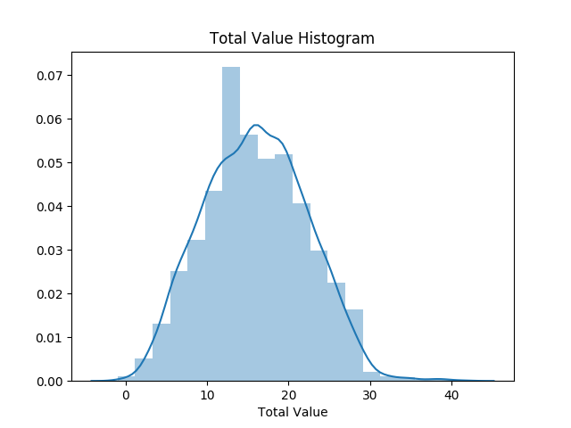
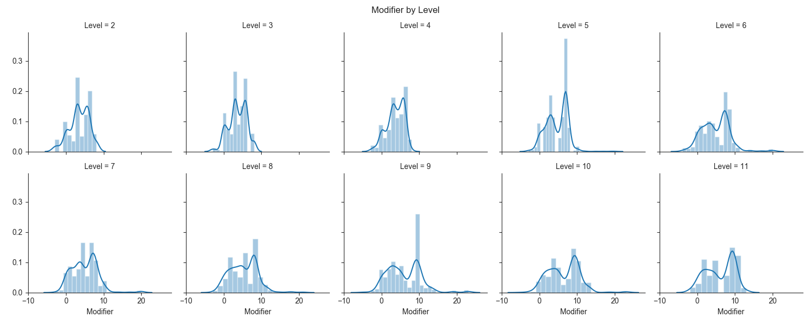

# Mighty-Rolls
A dive into a Dungeons and Dragons 5e campaign


# Introduction

Dungeons and Dragons 5th edition (DnD 5e) is a tabletop role-playing game published by Wizards of the Coast
The core rules of the game are formed by three kind of d20(20-sided die) rolls; ability checks, attack rolls,
and saving throws.

Tasks in the game follow three steps:
1. Roll the die and add a modifier
2. Apply circumstantial bonuses and penalties
3. Compare the total to a target number

This presentation will focus on the modifier value added a die roll.


# Importing and Cleaning the Data

Dataset located [here](https://docs.google.com/spreadsheets/d/1FFuw5c6Hk1NUlHv2Wvr5b9AElLA51KtRl9ZruPU8r9k/edit#gid=0), as a Google Sheets spreadsheet, maintained by the [CritRoleStats](https://www.critrolestats.com/), includes 11107 rows and 11 columns.
After cleaning, there are 6591 rows, and 6 important columns;
‘Character’, ‘Type of Roll’, ‘Total Value’, ‘Natural Value’, ‘Level’, and ‘Modifier = (Total Value - Natural Value)’

<details>
  <summary>Import code</summary>
  
  ```
  def html_to_df(dirpath):
    frames = []
    for filename in os.listdir(dirpath):
        if filename.endswith('.html'):
            fullpath = os.path.join(dirpath, filename)
            frames.append(pd.read_html(fullpath, header=1, index_col=0)[0])
    return pd.concat(frames).reset_index(drop=True)
  ```
 </details>
 
 <details>
    <summary>Clean data code</summary>
    
    ```
    def remove_rows(df, col, lst):
        df = df[~df[col].isin(lst)]
        return df[df[col].notnull()]
    
    def use_this_df():
        # create df of level in each episode
        ep_formatted = pd.read_csv('./data/level_by_ep.csv', names=['episode_int','Episode','Level'])
        df_ep_level = ep_formatted.filter(['episode_int', 'Level']).set_index('episode_int')
    
        # fix episode names
        df = html_to_df(dirpath).dropna(subset=['Episode'])
        df['episode_int'] = df['Episode'].apply(lambda x: x[-2:]).astype('int64')
    
        # join df_ep_level
        df = df.join(df_ep_level, on='episode_int')
    
        # remove not d20 rolls
        d20_filter_out_list = ['Other', 'Damage', 'Fragment', 'Percentage', 'Unknown', 'Hit Dice']
        df = remove_rows(df, 'Type of Roll', d20_filter_out_list)
    
        # clean Total Value
        remove_list = ['Nat'+str(i) for i in range(21)]
        remove_list.append('Unknown')
        df = remove_rows(df, 'Total Value', remove_list)
    
        # clean Natural Value
        remove_list = ['Unknown', 'Nat1', '-2', '24', '21', '0']
        df = remove_rows(df, 'Natural Value', remove_list)
    
        # filter down df
        df_filtered = df.filter(['Character', 'Type of Roll', 'Total Value', 'Natural Value', 'Level'])
    
        # cast value columns as int
        df_filtered['Total Value'] = df_filtered['Total Value'].astype('int32')
        df_filtered['Natural Value'] = df_filtered['Natural Value'].astype('int32')
    
        # create modifier column = total value - natural value
        df_filtered['Modifier'] = df_filtered['Total Value'] - df_filtered['Natural Value']
    
        # merge characters
        replace_dict = {
            'Cali': 'Other',
            'Clarabelle': 'Other',
            'Jannik': 'Other',
            'Keg': 'Other',
            'Nila': 'Other',
            'Nott': 'Nott/Veth',
            'Molly': 'Cad./Molly',
            'Reani': 'Other',
            'Shakäste': 'Other',
            'Spurt': 'Other',
            'Summoned Creature': 'Other',
            'Twiggy': 'Other',
            'Veth': 'Nott/Veth',
            'Willi': 'Other',
            'Yarnball': 'Other',
            'Caduceus': 'Cad./Molly',
            'Beetles': 'Other',
            'Nugget': 'Other',
            'Duchess': 'Other',
            'Frumpkin': 'Other'
        }
        df_filtered = df_filtered.replace(replace_dict)
        return df_filtered
    ```
  </details>

# Preliminary Plots
<details>
    <summary>Histogram Plot Function</summary>
    
    ```
    import seaborn as sns
    import numpy as np
    
    def dist_plot(df, col):
        data = df[col]
        sns.distplot(data, bins=np.arange(data.min(), data.max()+1)).set_title(f'{col} Histogram')'{col} Histogram')

    ```
</details>

<details>
<summary>Natural Value Histogram</summary>

    ```
    import matplotlib.pyplot as plt
    df = use_this_df()
    dist_plot(df, 'Natural Value')
    plt.show()
    ```

</details>


<details>
<summary>Total Value Histogram</summary>

    ```
    import matplotlib.pyplot as plt
    df = use_this_df()
    dist_plot(df, 'Total Value')
    plt.show()
    ```

</details>




# Focusing on Modifier

<details>
<summary>Modifier Histogram</summary>

    ```
    import matplotlib.pyplot as plt
    df = use_this_df()
    dist_plot(df, 'Modifier')
    plt.show()
    ```

</details>


<details>
<summary>Modifier by Level Boxplot</summary>

    ```
    from src.use_this import use_this_df
    import seaborn as sns
    import matplotlib.pyplot as plt
    
    df = use_this_df()
    
    sns.set_style('ticks')
    sns.color_palette('dark')
    ax = sns.boxplot(df['Level'], df['Modifier'])
    
    means = df.groupby('Level')['Modifier'].mean().values
    nobs = df.groupby('Level')['Modifier'].agg(['count'])
    nobs = ["n: " + str(i) for s in nobs.values for i in s]
    
    pos = range(len(nobs))
    for tick,label in zip(pos, ax.get_xticklabels()):
        ax.text(pos[tick], means[tick] + 1, s=nobs[tick], horizontalalignment='center', size='x-small', color='w',
                weight='semibold')
    
    ax.set_title('Modifier by Level - Boxplot')
    plt.show()
    ```

</details>


<details>
<summary>FacetGrid Histograms Function</summary>

    ```
    def plot_distplots(df, col, col_wrap, plot_col):
        g = sns.FacetGrid(df, col=col, col_wrap=col_wrap)
        g.map(sns.distplot, plot_col)
        plt.subplots_adjust(top=0.9)
        g.fig.suptitle(f'{plot_col} by {col}')
    ```

</details>

<details>
<summary>Modifier by Level Histograms</summary>

    ```
    from src.use_this import use_this_df
    from src.facetgrid_distplots import plot_distplots
    import seaborn as sns
    import matplotlib.pyplot as plt
    
    df = use_this_df()
    sns.set_style('ticks')
    plot_distplots(df, 'Level', 5, 'Modifier')
    plt.show()
    ```

</details>



# Hypothesis Test - Mann-Whitney U Test

Given the previous plots, and my understanding of the game rules, the following is set as the null hypothesis:
```
Modifiers at a lower level are equally likely to be higher than Modifiers at a higher level as the other way around
```
Using the following code to test the hypothesis as follows:

(Modifier at Level 11) < (Modifier at Level 2)

```
import scipy.stats as stats
stats.mannwhitneyu(df[df['Level'] == 11]['Modifier'], df[df['Level'] == 2]['Modifier'], alternative='greater')
```                 

This yields: p-value = 0

## Further Testing


Table values are the p-values from the Mann-Whitney test i.e P(Y>X) + .5*P(Y=X)

Rows are fixed Level tested against all other Levels

# Conclusion

From the p-values obtained from the Mann-Whitney tests, I believe that the value of the modifiers does, in fact, increase as level increases. 
However, the accuracy of these tests debatable because of two reasons. One reason is I assumed modifier and level were independent, and the sample size of modifiers at each level was varied.
More work would have to be done to test independence, and test similar sized samples.

#Next Steps

There many more facets of the game that can be explored to determine overall balancing of game features. Some of these include:
      
        Specific class features
        Damage rolls (non d20 rolls)
        Advantage/Disadvantage effects on Total Value
In a general sense, creating a normalized scale to study the impact of individual features would provide an intuitive way to quantify, and balance, design choices.
